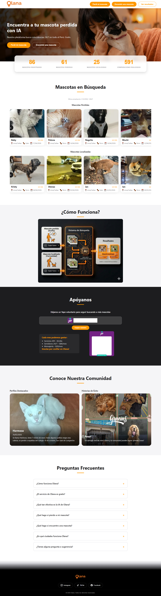

# Olana Platform: AI-Powered Multi-Modal Pet Recovery System

## 🐾 Overview
Olana is a high-performance, distributed platform designed to solve the critical challenge of reuniting lost pets with their families. Unlike traditional platforms that rely on manual searching, Olana implements a **3-Phase Hybrid Matching Engine** that leverages Multimodal AI (Google Gemini) and Distributed Systems to provide surgical precision at scale.

This repository serves as a **Conceptual Architecture Showcase** of the production system, highlighting the design patterns, AI integration strategies, and scalable infrastructure decisions.

---

## 🚀 Key Architectural Innovations

### 1. The 3-Phase Intelligent Matching Engine
To balance **cost-efficiency, speed, and precision**, I designed a proprietary matching pipeline:

*   **Phase 1: Structured Pre-Filtering (O(1) Scalability)**
    *   Utilizes MongoDB Geospatial indexes and structured attributes.
    *   Reduces the search space from millions to hundreds in milliseconds.
*   **Phase 2: Semantic Textual Ranking (LLM-driven)**
    *   Employs Google Gemini / Text Embeddings to analyze pet descriptions semantically.
    *   Understand that "golden-haired" is synonymous with "yellowish fur," moving beyond keyword matching.
*   **Phase 3: Multimodal Visual Verification (Deep Vision)**
    *   The "Gold Standard" of verification.
    *   Direct image-to-image comparison using Gemini's vision capabilities to detect unique markings, facial geometry, and scars with >95% accuracy.

### 2. Character Consistency via AI Profiling
Olana solves the problem of "sparse data" by using AI to generate a **Unified Pet Profile** from multiple photos.
*   Aggregates visual data from N images into a single structured JSON schema.
*   Ensures consistent identification even if photos are taken from different angles or lighting.

### 3. Distributed Task Processing
Built for high availability and responsiveness:
*   **Celery + Redis:** Handles long-running AI analysis and matching tasks asynchronously.
*   **FastAPI:** High-performance, asynchronous API layer for real-time user interactions.

---

## 🛠️ Tech Stack
*   **Backend:** Python 3.11, FastAPI
*   **AI/ML:** Google Gemini 2.5 Flash (Multimodal), Semantic Embeddings
*   **Database:** MongoDB Atlas (GridFS for image storage, Geospatial Indexing)
*   **Task Queue:** Celery, Redis
*   **Infrastructure:** Distributed Architecture, Container-ready

---

## 📐 Design Patterns & Principles
*   **Asynchronous Excellence:** Entirely non-blocking I/O for API responsiveness.
*   **Modular Monolith to Microservices Ready:** Decoupled modules for DB, AI, and Matching logic.
*   **Cost-Optimized AI:** Selective usage of LLM tokens based on search phase relevance.
*   **Clean Architecture:** Clear separation of concerns between business logic and infrastructure.

---

## 💡 Technical Challenges Solved
*   **LLM Cost Management:** Implementation of the 3-phase system to ensure expensive Vision API calls are only made on highly probable matches.
*   **Multi-image Synthesis:** Developing prompts and schemas to merge disparate visual data into a "Single Source of Truth" for a pet's identity.
*   **Scalable Matching:** Optimizing MongoDB queries to handle rapid growth in the "Lost & Found" database.

---

## 📝 Note
This is a **public showcase** version of a private production project. Key proprietary algorithms and sensitive schemas have been abstracted to protect intellectual property while demonstrating technical proficiency.

---

**Developed with ❤️ to bring pets home.**
